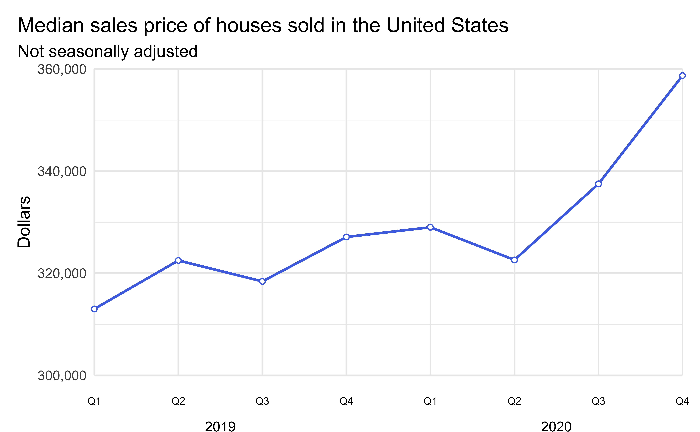

# homework-03

For any exercise where you’re writing code, insert a code chunk and make
sure to label the chunk. Use a short and informative label. For any
exercise where you’re creating a plot, make sure to label all axes,
legends, etc. and give it an informative title. For any exercise where
you’re including a description and/or interpretation, use full
sentences. Make a commit at least after finishing each exercise, or
better yet, more frequently. Push your work regularly to GitHub. Once
you’re done, inspect your GitHub repo to make sure it has all the
components you want to submit in the `hw-03.md` file, including the
prose, the code, and all plots.

1.  **Thank you.** Make a plot that says “Thank you” on it. Get
    creative! You can make it however you like, e.g., annotation, geoms,
    fake data, etc. There will be points assigned to creativity for this
    exercise. So just annotating the plot with the letters would earn
    fewer points than a more creative approach. Also, use as little as
    defaults as possible, in terms of color scales, themes, etc. The
    plots you make will be shared with our guest speakers as part of a
    “thank you” note. If you would like your name shown on the plots
    shared with them, you should add your name somewhere on the plot,
    e.g., the caption. If you don’t want your name shown, just leave it
    out and the plot will be shared anonymously. (There are no points
    attached to this, you can choose to share with your name or
    anonymously.)

2.  **Mirror, mirror on the wall, who’s the ugliest of them all?** Make
    a plot of the variables in the `penguins` dataset from the
    **palmerpenguins** package. Your plot should use at least two
    variables, but more is fine too. First, make the plot using the
    default theme and color scales. Then, update the plot to be as ugly
    as possible. You will probably want to play around with theme
    options, colors, fonts, etc. The ultimate goal is the ugliest
    possible plot, and the sky is the limit!

3.  **Median housing prices in the US.** The inspiration and the data
    for this exercise comes from
    <https://fred.stlouisfed.org/series/MSPUS>. The two datasets you’ll
    use are median_housing and recessions, both of which are in the data
    folder of your repository.

    -   Load the two datasets using `read_csv()`.

    -   Rename the variables as date and price.

    -   Create the following visualization.

    

    -   Identify recessions that happened during the time frame of the
        `median_housing` dataset. Do this by adding a new variable to
        recessions that takes the value TRUE if the recession happened
        during this time frame and FALSE if not.

    -   Now recreate the following visualization. The shaded areas are
        recessions that happened during the time frame of the
        `median_housing` dataset. Hint: The shaded areas are “behind” the
        line.

    

    -   Create a subset of the `median_housing` dataset for data from
        2019 and 2020 early. Add two columns: `year` and `quarter`.
        `year` is the year of the `date` and `quarter` takes the values
        Q1, Q2, Q3, or Q4 based on `date`.

    -   Create the following visualization.

    

4.  **Adopt, don’t shop.** The data for this exercise comes from [The
    Pudding](https://github.com/the-pudding/data/blob/master/dog-shelters/README.md)
    via
    [TidyTuesday](https://github.com/rfordatascience/tidytuesday/tree/master/data/2019/2019-12-17).

    -   Load the `dog_travel` dataset included in the `data` folder of
        your repository with `read_csv()`.

    -   Calculate the number of dogs available to adopt per
        `contact_state`. Save the result as a new data frame with
        variables `contact_state` and `n`.

    -   Make a histogram of the number of dogs available to adopt and
        describe the distribution of this variable.

    -   Use this dataset to make a map of the US states, where each
        state is filled in with a color based on the number of dogs
        available to adopt in that state. *Hints:*

        -   Use the `state_list` dataset which you can find in the
            `data` folder of your repo as a lookup table to match state
            names to abbreviations.
        -   Use a gradient color scale and `log10` transformation.

    -   Interpret the visualization.

5.  **To annotate, or not to annotate.** There are two ways you can get
    text on a ggplot: `geom_text()` and `annoate(geom = "text")`. Which
    one should you use when? *Hint:* Watch [this
    video](https://www.rstudio.com/resources/rstudioglobal-2021/always-look-on-the-bright-side-of-plots/)
    titled “Always look on the bright side of plots” by Kara Woo.
